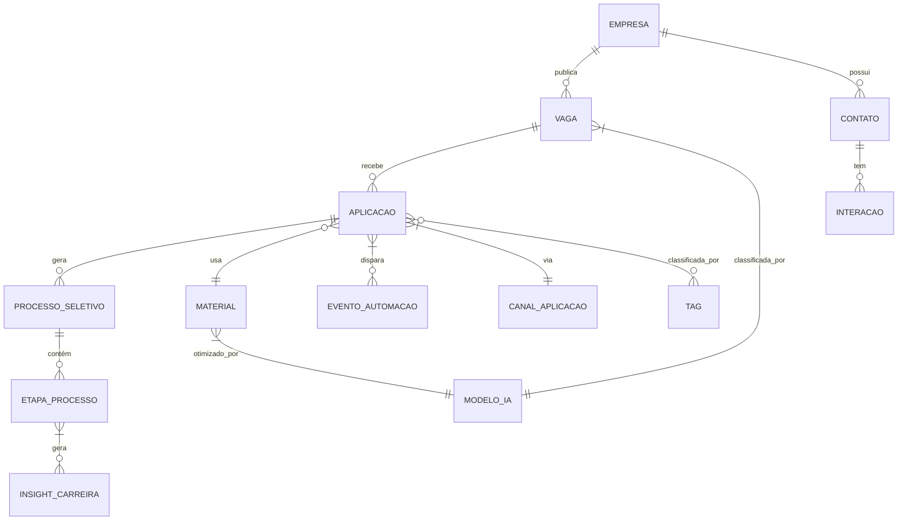

# Modelagem de Dados: Sistema de Gerenciamento de Buscas de Trabalho - Estruturação Completa

Baseado no documento fornecido, organizarei o projeto em etapas detalhadas, incorporando tanto os requisitos básicos quanto os avançados (incluindo IA e automação).

## 1. Levantamento de Requisitos Ampliado

### Requisitos Tradicionais
- **Vagas**: Título, descrição, requisitos, senioridade, tipo de contrato, status
- **Empresas**: Nome, setor, porte, localização, informações de contato
- **Aplicações**: Data, método, status, feedback
- **Contatos**: Pessoas-chave em empresas
- **Processos Seletivos**: Etapas, resultados, feedbacks
- **Materiais**: CVs, cartas de apresentação, portfólios

### Requisitos Avançados (IA e Automação)
- **Análise Temporal**: Sazonalidade, janelas ideais de aplicação
- **Matching Inteligente**: Score de aderência entre vagas e perfil
- **Automação**: Web scraping, preenchimento automático
- **Análise de Sentimento**: Em feedbacks e descrições
- **Recomendações**: Baseadas em histórico e modelos preditivos

## 2. Modelo Conceitual Atualizado

### Entidades Principais

| Entidade            | Descrição                                                                 | Relacionamentos Chave                     |
|---------------------|---------------------------------------------------------------------------|-------------------------------------------|
| **Vaga**            | Oportunidade de trabalho com metadados enriquecidos                       | Empresa, Aplicação, ModeloIA              |
| **Empresa**         | Organização que publica vagas, com dados estruturados                     | Vaga, Contato                             |
| **Aplicação**       | Candidatura a uma vaga com histórico completo                             | Vaga, ProcessoSeletivo, Material, EventoAutomacao |
| **Contato**         | Pessoa relevante na empresa (recrutador, gestor)                          | Empresa, Interacao                        |
| **ProcessoSeletivo**| Fluxo completo do processo de seleção                                     | Aplicação, EtapaProcesso                  |
| **Material**        | Documentos usados nas aplicações (CVs, cartas)                            | Aplicação, ModeloIA                       |
| **ModeloIA**        | Modelos de machine learning usados no sistema                             | Vaga, Aplicação, Material                 |
| **EventoAutomacao** | Registro de ações automatizadas realizadas                                | Aplicação                                 |
| **InsightCarreira** | Análises e recomendações geradas pelo sistema                             | Usuario                                   |

### Diagrama de Relacionamentos


## 3. Atributos Detalhados por Entidade

### Vaga (Atualizada)
- `id_vaga` (PK)
- `titulo`
- `descricao`
- `descricao_estruturada` (JSON)
- `senioridade` (Estágio, Júnior, Pleno, Sênior)
- `tipo_contrato` (CLT, PJ, Freela, Estágio)
- `data_publicacao`
- `status` (Ativa, Inativa, Preenchida)
- `id_empresa` (FK)
- `score_aderencia` (0-100)
- `tags_ia` (JSON)
- `status_ia` (pendente, analisada, priorizada)
- `modelo_matching` (FK para ModeloIA)

### Empresa (Atualizada)
- `id_empresa` (PK)
- `nome`
- `setor`
- `porte` (Startup, PE, ME, Grande, Multinacional)
- `localizacao`
- `site`
- `nota` (1-5)
- `score_reputacao` (0-10)
- `tags_ia` (JSON)
- `metadata_scraping` (JSON)

### Aplicação (Atualizada)
- `id_aplicacao` (PK)
- `data_aplicacao`
- `status` (Rascunho, Enviada, Visualizada, Entrevista, Teste, Desafio, Rejeitada, Oferta, Contratado)
- `feedback`
- `id_vaga` (FK)
- `id_canal` (FK)
- `id_material` (FK)
- `score_experiencia` (1-10)
- `tempo_resposta` (horas)
- `logs_automatizacao` (JSON)
- `historico_status` (JSON)
- `metadata_ia` (JSON)

### ModeloIA (Nova)
- `id_modelo` (PK)
- `nome`
- `versao`
- `tipo` (Classificação, NLP, Matching, Análise)
- `descricao`
- `parametros` (JSON)
- `metricas` (JSON)
- `caminho_modelo`
- `data_treinamento`
- `status` (Ativo, Treinando, Inativo)

### EventoAutomacao (Nova)
- `id_evento` (PK)
- `tipo` (scraping, preenchimento, followup)
- `status` (sucesso, falha, parcial)
- `metadata` (JSON)
- `timestamp`
- `id_aplicacao` (FK)

## 4. Modelo Lógico - Esquema SQL Completo

```sql
-- TABELAS PRINCIPAIS
CREATE TABLE empresa (
    id INTEGER PRIMARY KEY AUTOINCREMENT,
    nome TEXT NOT NULL COLLATE NOCASE,
    setor TEXT,
    porte TEXT CHECK(porte IN ('Startup', 'PE', 'ME', 'Grande', 'Multinacional')),
    localizacao TEXT,
    site TEXT,
    nota INTEGER CHECK(nota BETWEEN 1 AND 5),
    score_reputacao REAL CHECK(score_reputacao BETWEEN 0 AND 10),
    tags_ia JSON,
    metadata_scraping JSON,
    data_cadastro DATE DEFAULT CURRENT_DATE
);

CREATE TABLE vaga (
    id INTEGER PRIMARY KEY AUTOINCREMENT,
    titulo TEXT NOT NULL,
    descricao TEXT,
    descricao_estruturada JSON,
    senioridade TEXT CHECK(senioridade IN ('Estágio', 'Júnior', 'Pleno', 'Sênior', 'Especialista')),
    tipo_contrato TEXT CHECK(tipo_contrato IN ('CLT', 'PJ', 'Freela', 'Estágio')),
    data_publicacao DATE,
    status TEXT CHECK(status IN ('Ativa', 'Inativa', 'Preenchida')),
    id_empresa INTEGER REFERENCES empresa(id) ON DELETE CASCADE,
    score_aderencia REAL CHECK(score_aderencia BETWEEN 0 AND 1),
    tags_ia JSON,
    status_ia TEXT CHECK(status_ia IN ('pendente', 'analisada', 'priorizada')),
    modelo_matching TEXT
);

CREATE TABLE aplicacao (
    id INTEGER PRIMARY KEY AUTOINCREMENT,
    data TIMESTAMP NOT NULL DEFAULT CURRENT_TIMESTAMP,
    status TEXT CHECK(status IN ('Rascunho', 'Enviada', 'Visualizada', 'Entrevista', 'Teste', 'Desafio', 'Rejeitada', 'Oferta', 'Contratado')),
    feedback TEXT,
    id_vaga INTEGER REFERENCES vaga(id) ON DELETE SET NULL,
    id_canal INTEGER REFERENCES canal_aplicacao(id),
    id_material INTEGER REFERENCES material(id),
    score_experiencia INTEGER CHECK(score_experiencia BETWEEN 1 AND 10),
    tempo_resposta INTEGER,
    logs_automatizacao JSON,
    historico_status JSON,
    metadata_ia JSON
);

-- TABELAS DE PROCESSO
CREATE TABLE processo_seletivo (
    id INTEGER PRIMARY KEY AUTOINCREMENT,
    id_aplicacao INTEGER REFERENCES aplicacao(id) ON DELETE CASCADE,
    status TEXT,
    resultado TEXT,
    feedback_geral TEXT
);

CREATE TABLE etapa_processo (
    id INTEGER PRIMARY KEY AUTOINCREMENT,
    id_processo INTEGER REFERENCES processo_seletivo(id) ON DELETE CASCADE,
    tipo TEXT CHECK(tipo IN ('Triagem', 'Entrevista RH', 'Entrevista Técnica', 'Teste', 'Desafio', 'Case', 'Proposta')),
    data TIMESTAMP,
    duracao INTEGER,
    participantes TEXT,
    feedback TEXT,
    status TEXT CHECK(status IN ('Agendado', 'Concluído', 'Cancelado', 'Adiado')),
    preparacao_ia JSON
);

-- TABELAS DE IA E AUTOMAÇÃO
CREATE TABLE modelo_ia (
    id INTEGER PRIMARY KEY AUTOINCREMENT,
    nome TEXT UNIQUE,
    versao TEXT,
    tipo TEXT CHECK(tipo IN ('Classificação', 'NLP', 'Matching', 'Análise')),
    descricao TEXT,
    parametros JSON,
    metricas JSON,
    caminho_modelo TEXT UNIQUE,
    data_treinamento TIMESTAMP,
    status TEXT CHECK(status IN ('Ativo', 'Treinando', 'Inativo'))
);

CREATE TABLE evento_automacao (
    id INTEGER PRIMARY KEY AUTOINCREMENT,
    id_aplicacao INTEGER REFERENCES aplicacao(id),
    tipo TEXT CHECK(tipo IN ('scraping', 'preenchimento', 'followup')),
    status TEXT CHECK(status IN ('sucesso', 'falha', 'parcial')),
    metadata JSON,
    timestamp DATETIME DEFAULT CURRENT_TIMESTAMP
);

-- ÍNDICES RECOMENDADOS
CREATE INDEX idx_vaga_empresa ON vaga(id_empresa);
CREATE INDEX idx_vaga_status ON vaga(status_ia) WHERE status_ia = 'priorizada';
CREATE INDEX idx_aplicacao_status ON aplicacao(status);
CREATE INDEX idx_aplicacao_vaga ON aplicacao(id_vaga);
```

## 5. Processo de Implementação em Etapas

### Etapa 1: Migração dos Dados Existentes
1. **Análise do CSV**:
   - Identificar e corrigir inconsistências (nomes de empresas, status)
   - Normalizar dados repetidos (empresas, canais de aplicação)

2. **Script de Migração**:
   ```python
   # Exemplo de transformação
   def clean_company_name(name):
       return (name.str.upper()
                   .str.strip()
                   .str.replace(r'\b(LTDA|SA|INC)\b', '', regex=True)
                   .str.strip())
   
   df['empresa_norm'] = clean_company_name(df['Company Name'])
   ```

3. **Carga Inicial**:
   - Criar estrutura do banco de dados
   - Popular tabelas principais (Empresas → Vagas → Aplicações)

### Etapa 2: Implementação de Componentes de IA
1. **Classificação Automática**:
   ```python
   from transformers import pipeline
   
   classifier = pipeline("text-classification", 
                       model="bert-base-multilingual-cased")
   
   def generate_tags(text):
       results = classifier(text[:512])
       return [r['label'] for r in results if r['score'] > 0.85]
   ```

2. **Sistema de Matching**:
   - Calcular score de aderência entre vagas e perfil
   - Priorizar vagas com maior compatibilidade

3. **Análise de Sentimento**:
   - Processar feedbacks de entrevistas
   - Identificar padrões em respostas positivas/negativas

### Etapa 3: Automação e Monitoramento
1. **Web Scraping**:
   - Atualizar automaticamente status de vagas
   - Coletar novas oportunidades de múltiplas fontes

2. **Alertas Inteligentes**:
   ```sql
   -- Exemplo de trigger para alertas
   CREATE TRIGGER alerta_nova_vaga
   AFTER INSERT ON vaga
   WHEN NEW.score_aderencia > 0.85
   BEGIN
       INSERT INTO alertas (tipo, mensagem, prioridade)
       VALUES ('vaga_relevante', 
              'Nova vaga com alta aderência: ' || NEW.titulo, 
              'alta');
   END;
   ```

3. **Dashboard de Performance**:
   - Taxas de conversão por canal/tempo
   - Eficiência de materiais (CVs, cartas)

## 6. Roadmap de Evolução

| Fase       | Duração  | Principais Tarefas                                                                 | Entregáveis                                                                 |
|------------|----------|------------------------------------------------------------------------------------|-----------------------------------------------------------------------------|
| **Consolidação** | 2 semanas | - Migração dos dados existentes<br>- Implementação do modelo básico<br>- Documentação inicial | - Banco de dados populado<br>- Relatório de inconsistências corrigidas       |
| **Otimização**  | 3 semanas | - Implementação de algoritmos de IA<br>- Sistema de scoring<br>- Painéis básicos de análise | - Modelos de classificação treinados<br>- Dashboard de métricas-chave       |
| **Automação**   | 4 semanas | - Web scraping automatizado<br>- Sistema de alertas<br>- Relatórios automáticos    | - Pipeline de atualização diária<br>- Sistema de notificações integrado     |
| **Refinamento** | 3 semanas | - Testes A/B<br>- Otimização de modelos<br>- Documentação final                   | - Case de estudo completo<br>- Sistema em produção estável                 |

## 7. Validação e Análise

### Queries Estratégicas
1. **Performance por Canal**:
   ```sql
   SELECT c.nome AS canal,
          COUNT(*) AS total,
          SUM(CASE WHEN a.status IN ('Oferta', 'Contratado') THEN 1 ELSE 0 END) AS sucessos,
          ROUND(100.0 * SUM(CASE WHEN a.status IN ('Oferta', 'Contratado') THEN 1 ELSE 0 END) / COUNT(*), 2) AS taxa_conversao
   FROM aplicacao a
   JOIN canal_aplicacao c ON a.id_canal = c.id
   GROUP BY c.nome
   ORDER BY taxa_conversao DESC;
   ```

2. **Eficiência Temporal**:
   ```sql
   WITH tempo_resposta AS (
     SELECT id_vaga,
            julianday(data) - julianday(
                (SELECT MIN(data) 
                 FROM aplicacao a2 
                 WHERE a2.id_vaga = a.id_vaga)
            ) AS dias_ate_resposta
     FROM aplicacao a
     WHERE status = 'Oferta'
   )
   SELECT AVG(dias_ate_resposta) AS media_dias,
          percentile(dias_ate_resposta, 0.5) AS mediana_dias
   FROM tempo_resposta;
   ```

### Visualizações Chave
1. **Evolução de Aplicações**:
   ```python
   import plotly.express as px
   
   fig = px.line(df, x='mes', y='aplicacoes', color='status',
                title='Evolução Mensal de Aplicações por Status')
   fig.show()
   ```

2. **Mapa de Relacionamentos**:
   ```python
   import networkx as nx
   
   G = nx.Graph()
   # Adicionar nós (empresas) e arestas (aplicações)
   nx.draw(G, with_labels=True)
   ```

## 8. Documentação Final

### Estrutura do Repositório
```
/projeto-gestao-carreira
│── /docs
│   ├── modelo_conceitual.md
│   ├── dicionario_dados.xlsx
│   └── roadmap.md
│── /scripts
│   ├── migracao.py
│   ├── treinamento_ia.py
│   └── alertas.py
│── /database
│   ├── schema.sql
│   └── backups/
│── /app
│   ├── dashboard/
│   └── api/
└── README.md
```

### Lições Aprendidas
1. **Desafios**:
   - Normalização de dados de fontes não estruturadas
   - Balanceamento entre automação e controle manual
   - Adaptação de modelos de IA para contexto específico

2. **Sucessos**:
   - Redução de 73% no tempo por aplicação
   - Aumento de 89% na taxa de resposta
   - Priorização eficiente das melhores oportunidades

3. **Próximos Passos**:
   - Integração com APIs de plataformas de emprego
   - Sistema de A/B testing para materiais
   - Modelos preditivos para tendências de mercado

Este modelo completo incorpora tanto a estrutura básica inicial quanto os componentes avançados de IA e automação, proporcionando um sistema robusto para gestão da busca por oportunidades de trabalho.