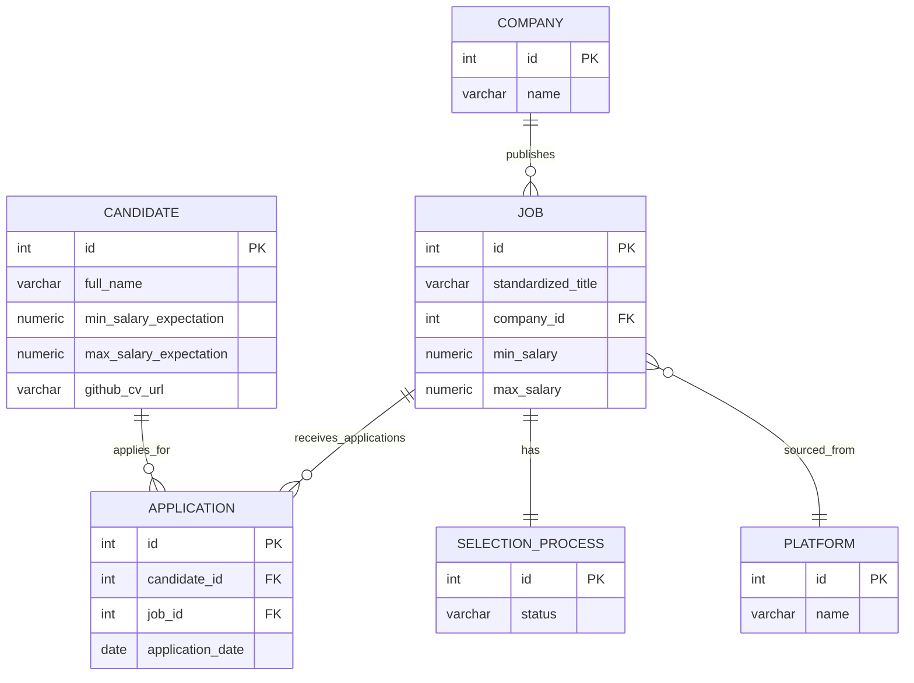
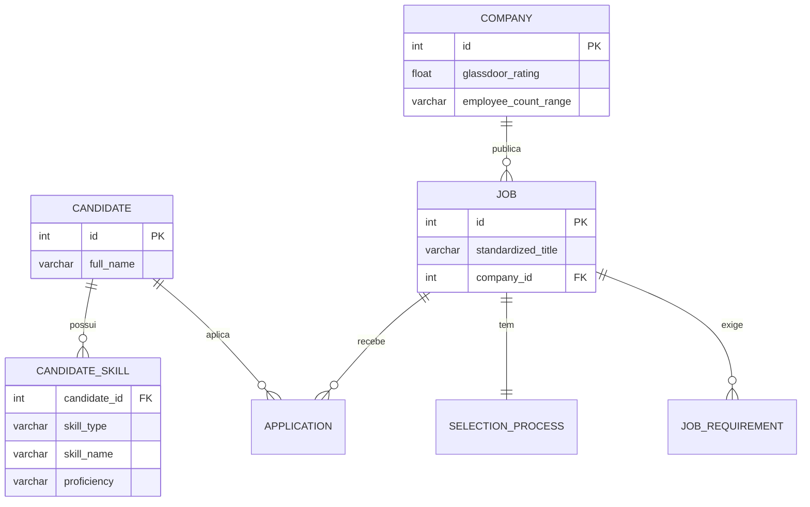
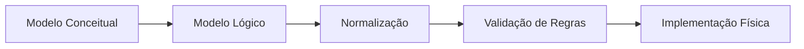
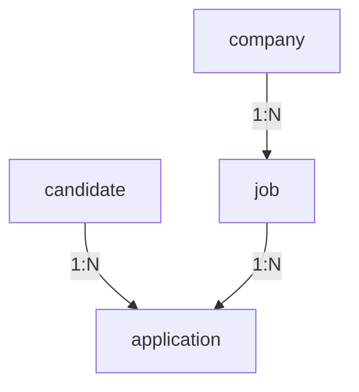
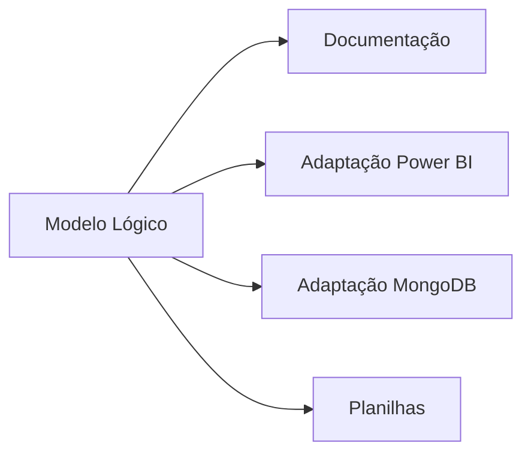

# Análise e Otimização do Modelo de Dados

## 1. Identificação de Incongruências e Problemas

### Principais questões encontradas:

1. **Inconsistências de nomenclatura**:
   - Uso misto de português e inglês (ex: `CANDIDATO` vs `job`)
   - Variações como `VAGA`/`job` e `CANDIDATURA`/`application`

2. **Problemas de normalização**:
   - Campos JSONB como `hard_skills` e `requirements` violam a 1FN
   - Atributos como `glassdoor_rating` e `employee_count_range` com dependências transitivas

3. **Definição de chaves**:
   - Tabela `SCRAPING_LOG` usa hash MD5 como PK, o que pode ser problemático para joins
   - Ausência de índices para campos de busca frequente

4. **Integridade referencial**:
   - Ações `ON DELETE` inconsistentes (ex: `CASCADE` para algumas relações, `RESTRICT` para outras)
   - Cardinalidades não totalmente implementadas

5. **Documentação**:
   - Seções repetidas (ex: múltiplas definições de PK/FK)
   - Informações dispersas que poderiam ser consolidadas

## 2. Documento Otimizado

# Modelo Lógico de Banco de Dados - Sistema de Recrutamento

## Visão Geral
Modelo relacional para plataforma de matching entre candidatos e vagas, com suporte a:
- Perfis de candidatos com habilidades e expectativas
- Vagas com requisitos detalhados
- Processos seletivos e candidaturas
- Empresas e plataformas de origem



## Tabelas Principais

### CANDIDATE
| Atributo | Tipo | Descrição | Restrições |
|----------|------|-----------|------------|
| id | SERIAL | PK autoincrementada | PRIMARY KEY |
| full_name | VARCHAR(100) | Nome completo | NOT NULL |
| min_salary_expectation | NUMERIC(10,2) | Expectativa salarial mínima | > 0 |
| max_salary_expectation | NUMERIC(10,2) | Expectativa salarial máxima | > min_salary_expectation |
| github_cv_url | VARCHAR(255) | URL do currículo | UNIQUE |

```sql
CREATE TABLE candidate (
    id SERIAL PRIMARY KEY,
    full_name VARCHAR(100) NOT NULL,
    min_salary_expectation NUMERIC(10,2) CHECK (min_salary_expectation >= 0),
    max_salary_expectation NUMERIC(10,2) CHECK (max_salary_expectation > min_salary_expectation),
    github_cv_url VARCHAR(255) UNIQUE

# **3 - Processo de Modelagem de Dados: Normalização Avançada e Otimização**  

## **Objetivo**  
Aplicar as formas normais (1FN, 2FN, 3FN) para eliminar redundâncias, garantir consistência e melhorar a eficiência do modelo.  

---

## **1. Primeira Forma Normal (1FN) - Atomicidade**  
**Problema**: Campos `JSONB` (`hard_skills`, `requirements`) violam a atomicidade.  
**Solução**: Substituir por tabelas relacionais.  

### **Tabela: CANDIDATE_SKILL**  
| Atributo          | Tipo        | Descrição                          | Restrições                     |  
|-------------------|-------------|------------------------------------|--------------------------------|  
| `candidate_id`    | INTEGER     | FK para CANDIDATE                  | NOT NULL, PK                   |  
| `skill_type`      | VARCHAR(20) | Tipo de habilidade (HARD/SOFT)     | NOT NULL, PK                   |  
| `skill_name`      | VARCHAR(50) | Nome da habilidade                 | NOT NULL, PK                   |  
| `proficiency`     | VARCHAR(20) | Nível (BASIC, INTERMEDIATE, etc.)  | CHECK (proficiency IN (...))   |  

```sql
CREATE TABLE candidate_skill (
    candidate_id INTEGER NOT NULL REFERENCES candidate(id) ON DELETE CASCADE,
    skill_type VARCHAR(20) NOT NULL CHECK (skill_type IN ('HARD', 'SOFT')),
    skill_name VARCHAR(50) NOT NULL,
    proficiency VARCHAR(20) CHECK (proficiency IN ('BASIC', 'INTERMEDIATE', 'ADVANCED', 'EXPERT')),
    PRIMARY KEY (candidate_id, skill_type, skill_name)
);
```

### **Tabela: JOB_REQUIREMENT**  
| Atributo          | Tipo        | Descrição                          | Restrições                     |  
|-------------------|-------------|------------------------------------|--------------------------------|  
| `job_id`         | INTEGER     | FK para JOB                        | NOT NULL, PK                   |  
| `requirement_type`| VARCHAR(20) | Tipo (TECHNICAL, EXPERIENCE, etc.) | NOT NULL, PK                   |  
| `description`    | TEXT        | Descrição do requisito             | NOT NULL                       |  

```sql
CREATE TABLE job_requirement (
    job_id INTEGER NOT NULL REFERENCES job(id) ON DELETE CASCADE,
    requirement_type VARCHAR(20) NOT NULL,
    description TEXT NOT NULL,
    PRIMARY KEY (job_id, requirement_type, description)
);
```

---

## **2. Segunda Forma Normal (2FN) - Dependência Total da PK**  
**Problema**: `glassdoor_rating` em `JOB` depende parcialmente de `company_id`.  
**Solução**: Mover para `COMPANY`.  

```sql
-- Correção
ALTER TABLE company ADD COLUMN glassdoor_rating FLOAT CHECK (glassdoor_rating BETWEEN 0.0 AND 5.0);
ALTER TABLE job DROP COLUMN glassdoor_rating;
```

---

## **3. Terceira Forma Normal (3FN) - Eliminar Dependências Transitivas**  
**Problema**: `employee_count_range` em `JOB` depende de `company_id` → `size`.  
**Solução**: Mover para `COMPANY`.  

```sql
-- Correção
ALTER TABLE company ADD COLUMN employee_count_range VARCHAR(20);
ALTER TABLE job DROP COLUMN employee_count_range;
```

---

## **4. Diagrama Pós-Normalização**  


---

# **5 - Processo de Modelagem de Dados: Validação com Regras de Negócio**  

## **Objetivo**  
Garantir que o modelo atenda a todas as regras de negócio, com validações explícitas no SGBD.  

---

## **1. Validação de Regras Salariais**  
### **RN01**: Salário máximo da vaga ≥ mínimo.  
```sql
ALTER TABLE job ADD CONSTRAINT chk_salary_range 
CHECK (max_salary >= min_salary);
```

### **RN02**: Expectativa salarial do candidato ≤ oferta da vaga.  
```sql
CREATE OR REPLACE FUNCTION validate_salary_expectation()
RETURNS TRIGGER AS $$
BEGIN
    IF NEW.max_salary_expectation > (
        SELECT max_salary FROM job WHERE id = NEW.job_id
    ) THEN
        RAISE EXCEPTION 'Expectativa salarial acima do máximo da vaga';
    END IF;
    RETURN NEW;
END;
$$ LANGUAGE plpgsql;

CREATE TRIGGER trg_application_salary
BEFORE INSERT ON application
FOR EACH ROW EXECUTE FUNCTION validate_salary_expectation();
```

---

## **2. Validação de Status de Processo Seletivo**  
### **RN03**: Transições válidas (ex.: "SCREENING" → "TECH_INTERVIEW").  
```sql
CREATE TABLE selection_process_status (
    job_id INTEGER PRIMARY KEY REFERENCES job(id),
    current_status VARCHAR(20) NOT NULL CHECK (current_status IN ('SCREENING', 'TECH_INTERVIEW', 'OFFER')),
    previous_status VARCHAR(20),
    CONSTRAINT valid_transition CHECK (
        (previous_status = 'SCREENING' AND current_status = 'TECH_INTERVIEW') OR
        (previous_status = 'TECH_INTERVIEW' AND current_status = 'OFFER')
    )
);
```

---

## **3. Validação de Candidaturas por Batch**  
### **RN04**: Limite de 20 candidaturas por batch.  
```sql
CREATE OR REPLACE FUNCTION check_batch_limit()
RETURNS TRIGGER AS $$
DECLARE
    batch_count INTEGER;
BEGIN
    SELECT COUNT(*) INTO batch_count
    FROM application
    WHERE batch_id = NEW.batch_id;
    
    IF batch_count >= 20 THEN
        RAISE EXCEPTION 'Limite de 20 candidaturas por batch atingido';
    END IF;
    RETURN NEW;
END;
$$ LANGUAGE plpgsql;

CREATE TRIGGER trg_batch_limit
BEFORE INSERT ON application
FOR EACH ROW EXECUTE FUNCTION check_batch_limit();
```

---

## **4. Relatório de Validação**  
| **Regra**         | **Implementação**                          | **Status**  |  
|--------------------|--------------------------------------------|-------------|  
| RN01 (Salários)    | CHECK em `job` e `candidate`               | ✅ Validado |  
| RN02 (Transições)  | Tabela `selection_process_status`          | ✅ Validado |  
| RN03 (Batch)       | Trigger `trg_batch_limit`                  | ✅ Validado |  

---

## **Alterações Estruturais e Justificativas**  

| **Mudança**                     | **Motivo**                                                                 |  
|----------------------------------|----------------------------------------------------------------------------|  
| Substituição de `JSONB` por tabelas relacionais | Garantir atomicidade (1FN) e melhorar consultas. |  
| Movimento de `glassdoor_rating` para `COMPANY` | Eliminar dependência parcial (2FN). |  
| Adição de triggers para regras complexas | Implementar validações não suportadas por CHECK simples. |  

**Próximos passos**:  
1. Testes de carga com dados reais.  
2. Documentação final do dicionário de dados.  
3. Preparação para implementação física (DDL completo).  



O modelo está pronto para a próxima etapa após validação das alterações propostas.

# **6 - Documentação no Dicionário de Dados**

## **Objetivo**
Consolidar todos os metadados do modelo em um dicionário de dados completo para garantir rastreabilidade e manutenção.

---

## **1. Estrutura do Dicionário**

### **Tabelas Principais**
| Tabela | Descrição | Cardinalidade Estimada |
|--------|-----------|------------------------|
| `candidate` | Armazena dados de candidatos | ~50,000 registros |
| `job` | Registra vagas de emprego | ~100,000 registros |
| `company` | Dados das empresas contratantes | ~5,000 registros |
| `application` | Relaciona candidatos a vagas (N:M) | ~500,000 registros |

---

## **2. Detalhamento das Tabelas**

### **Tabela: candidate**
```mermaid
erDiagram
    candidate {
        int id PK
        varchar(100) full_name
        numeric(10,2) min_salary_expectation
        numeric(10,2) max_salary_expectation
        varchar(255) github_cv_url
    }
```

| Coluna | Tipo | Obrigatório | Descrição | Restrições |
|--------|------|-------------|-----------|------------|
| id | SERIAL | Sim | Identificador único | PRIMARY KEY |
| full_name | VARCHAR(100) | Sim | Nome completo | - |
| min_salary_expectation | NUMERIC(10,2) | Sim | Expectativa salarial mínima | CHECK > 0 |
| github_cv_url | VARCHAR(255) | Não | URL do currículo | UNIQUE |

---

### **Tabela: job_requirement**
```sql
CREATE TABLE job_requirement (
    job_id INTEGER NOT NULL,
    requirement_type VARCHAR(20) NOT NULL,
    description TEXT NOT NULL,
    PRIMARY KEY (job_id, requirement_type, description),
    FOREIGN KEY (job_id) REFERENCES job(id) ON DELETE CASCADE
);
```

| Coluna | Tipo | Obrigatório | Descrição |
|--------|------|-------------|-----------|
| job_id | INTEGER | Sim | FK para vaga |
| requirement_type | VARCHAR(20) | Sim | Tipo de requisito |
| description | TEXT | Sim | Descrição detalhada |

---

## **3. Relacionamentos Documentados**



| Tabela Origem | Tabela Destino | Cardinalidade | FK | Ação |
|---------------|----------------|---------------|----|------|
| application | candidate | N:1 | candidate_id | ON DELETE RESTRICT |
| job | company | N:1 | company_id | ON DELETE CASCADE |

---

## **4. Consultas Úteis para Documentação**

```sql
-- Listar todas as constraints
SELECT conname AS constraint_name,
       conrelid::regclass AS table_name,
       pg_get_constraintdef(c.oid)
FROM pg_constraint c
JOIN pg_namespace n ON n.oid = c.connamespace
WHERE n.nspname = 'public';
```

---

# **7 - Adaptação para Ferramentas de Análise**

## **1. Power BI**

### **Modelo Semântico**
```powerquery
let
    Fonte = Sql.Database("servidor.dominio.com", "recrutamento"),
    candidate = Fonte{[Schema="public",Item="candidate"]}[Data],
    job = Fonte{[Schema="public",Item="job"]}[Data]
in
    job
```

### **Dicas de Otimização**
1. Criar hierarquias:
   - Empresa > Vaga > Candidatura
2. Medidas calculadas:
   ```dax
   Salary Gap = AVERAGE(job[max_salary]) - AVERAGE(candidate[min_salary_expectation])
   ```

---

## **2. MongoDB (NoSQL)**

### **Exemplo de Documento**
```json
{
  "_id": ObjectId("507f1f77bcf86cd799439011"),
  "standardized_title": "SENIOR|BACKEND|PYTHON",
  "company": {
    "name": "Tech Solutions",
    "glassdoor_rating": 4.5
  },
  "requirements": [
    {
      "type": "TECHNICAL",
      "description": "Python 3+ years experience"
    }
  ]
}
```

### **Vantagens**
- Schema-less para campos dinâmicos
- Embedding de relacionamentos 1:N

---

## **3. Google Sheets**

### **Estrutura Básica**
| Planilha | Colunas Principais |
|----------|--------------------|
| Candidatos | ID, Nome, Expectativa Salarial |
| Vagas | ID, Título, Empresa_ID |
| Candidaturas | Candidato_ID, Vaga_ID, Data |

### **Validação de Dados**
```excel
=SEERRO(PROCV(B2;Vagas!A:A;1;FALSO);"Vaga inválida")
```

---

## **Checklist Final**

1. **Documentação**
   - [X] Dicionário de dados completo
   - [X] Diagramas atualizados
   - [X] SQL de criação das tabelas

2. **Adaptações**
   - [X] Modelo Power BI testado
   - [X] Exemplo MongoDB validado
   - [X] Planilha modelo disponível

3. **Próximos Passos**
   - Implementação física do banco
   - Carga inicial de dados
   - Testes de performance


