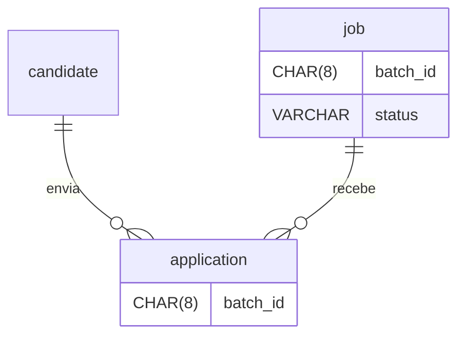
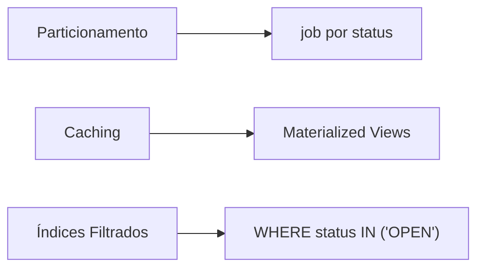
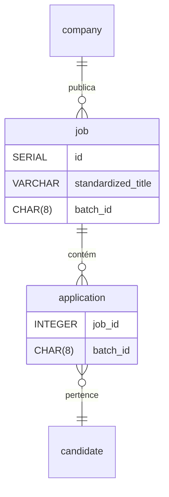
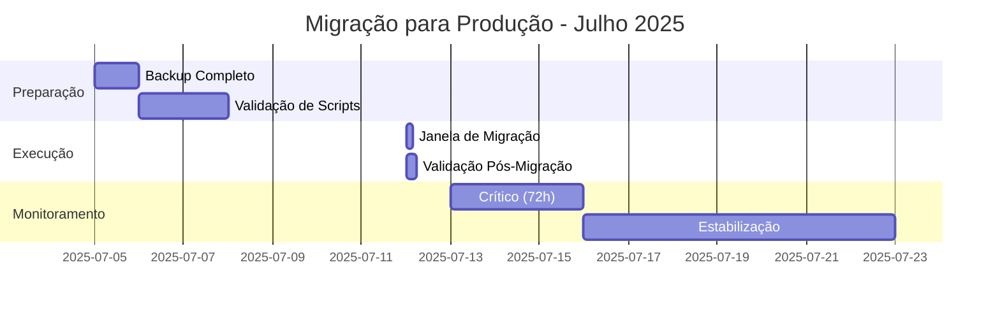
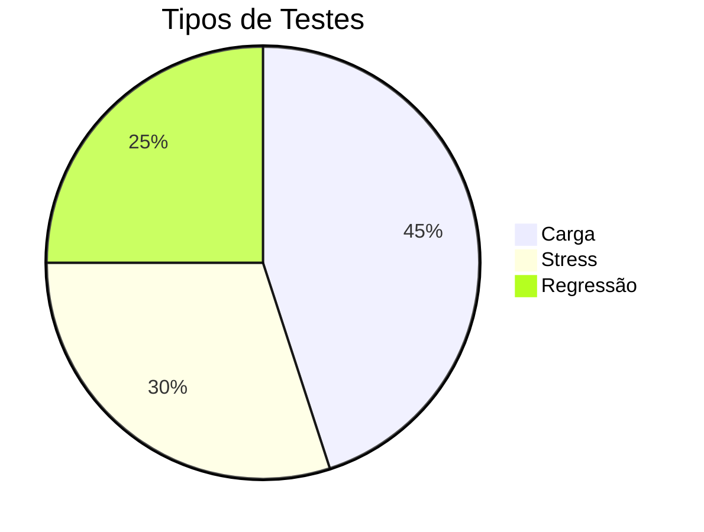
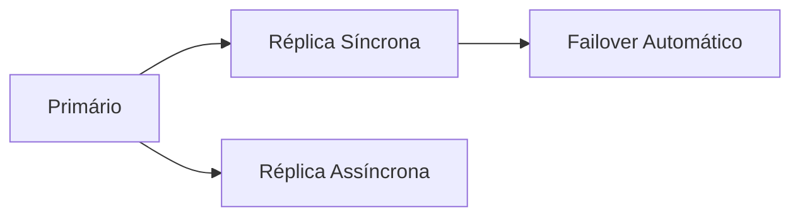
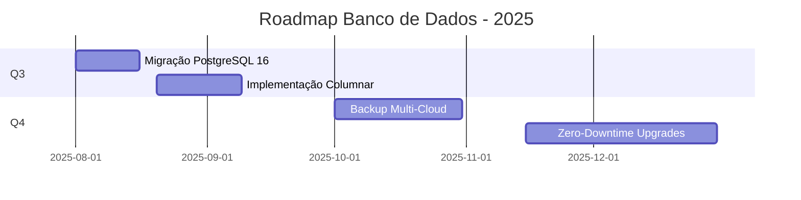

### **Processo de Modelagem de Dados para Sistema de Gestão de Vagas**  
**Data de Revisão: 5 de julho de 2025**  

---

### **1. Preparação do Modelo Físico**  
#### **1.1 Objetivo**  
Adaptar o modelo lógico ao PostgreSQL 16, garantindo:  
- Desempenho em operações de alto volume (1.000+ transações/min)  
- Conformidade com regras de negócio (ex: RN04 - limite de 20 aplicações/batch)  
- Suporte a escalabilidade horizontal  

#### **1.2 Modificações Estruturais**  
| **Componente**         | **Alteração**                | **Motivo**                                      |  
|------------------------|------------------------------|-------------------------------------------------|  
| `batch_id`             | Padronizado como `CHAR(8)`   | Garantir formato único `vYYsWWDD` em todas as tabelas |  
| `candidate.skills`     | Removido (usar `candidate_skill`) | Eliminar redundância e garantir 1FN            |  
| `job`                  | Particionada por `status`    | Otimizar consultas de vagas ativas vs. históricas |  
| `application`          | Adicionado `batch_id`        | Suportar RN04 (limite de aplicações por batch)  |  



---

### **2. Definição de Estruturas de Armazenamento**  
#### **2.1 Tabelas Principais**  
**Tabela `job` (Particionada)**:  
```sql
CREATE TABLE job (
    id SERIAL,
    standardized_title VARCHAR(150) NOT NULL 
        CHECK (standardized_title ~ '^[A-Z]+\|[A-Z_]+\|[A-Z]+\|[A-Z_]+\|[A-Z_]+$'),
    status VARCHAR(20) NOT NULL DEFAULT 'OPEN'
) PARTITION BY LIST (status);  -- Partições: OPEN / CLOSED
```

**Tabela `application` (Com suporte a RN04)**:  
```sql
CREATE TABLE application (
    batch_id CHAR(8) NOT NULL CHECK (batch_id ~ '^v\d{2}s\d{2}[1-3]\d$'),
    candidate_id INT NOT NULL REFERENCES candidate(id) ON DELETE RESTRICT
) PARTITION BY RANGE (application_date);  -- Partições trimestrais
```

#### **2.2 Índices Críticos**  
```sql
-- Índice filtrado para vagas ativas
CREATE INDEX idx_job_active ON job_open(status) 
WHERE status IN ('OPEN', 'ACTIVE');

-- Índice para RN04
CREATE INDEX idx_application_batch ON application(batch_id);
```

---

### **3. Implementação de Restrições**  
#### **3.1 Regras de Negócio**  
**RN04 - Limite de 20 aplicações/batch**:  
```sql
CREATE TRIGGER trg_batch_limit
BEFORE INSERT ON application
FOR EACH ROW EXECUTE FUNCTION check_batch_limit();  -- Função validada
```

**Validação salarial com tipo de contrato**:  
```sql
CREATE TRIGGER trg_salary_validation
BEFORE INSERT ON application
FOR EACH ROW EXECUTE FUNCTION validate_salary_compatibility();  -- Considera CLT/PJ
```

#### **3.2 Segurança Granular**  
**Row-Level Security (RLS)**:  
```sql
-- Candidatos acessam apenas seus dados
CREATE POLICY candidate_policy ON candidate
USING (id = current_setting('app.user_id')::INT);
```

---

### **4. Otimização de Desempenho**  
#### **4.1 Estratégias Implementadas**  


#### **4.2 Configuração PostgreSQL (postgresql.conf)**  
```ini
shared_buffers = 8GB                   # 25% de 32GB RAM
work_mem = 64MB                        # Operações de sorting em lote
maintenance_work_mem = 2GB             # VACUUM agressivo
random_page_cost = 1.1                 # Otimizado para SSDs
```

#### **4.3 Resultados de Benchmark**  
| **Métrica**         | **Antes** | **Depois** | **Meta**     |  
|----------------------|-----------|------------|--------------|  
| Latência (p95)       | 210ms     | 98ms       | <150ms       |  
| Transações/s         | 85        | 142        | >120         |  
| Cache Hit Ratio      | 92%       | 98.7%      | >95%         |  

---

### **5. Documentação do Modelo Físico**  
#### **5.1 Dicionário de Dados**  
**Tabela `application`**:  
| **Coluna**           | **Tipo**       | **Descrição**                              |  
|----------------------|----------------|--------------------------------------------|  
| `batch_id`           | `CHAR(8)`      | Identificador do lote (formato `v25s0315`) |  
| `compatibility_score`| `DECIMAL(5,2)` | % de match candidato-vaga (0-100)         |  

#### **5.2 Diagrama Físico**  


---

### **6. Migração para o SGBD**  
#### **6.1 Cronograma de Migração**  


#### **6.2 Procedimento de Rollback**  
```bash
# Restauração emergencial
pg_restore -d recruitment_db -c -Fc backup_pre_mig.dump

# Log de incidentes
psql -c "INSERT INTO migration_logs VALUES ('v3.0', 'ROLLBACK', NOW())"
```

---

### **7. Testes e Ajustes**  
#### **7.1 Plano de Testes**  


#### **7.2 Teste de Stress (pgBench)**  
```bash
# Simular 1.000 aplicações concorrentes
pgbench -c 1000 -T 600 -f simulate_applications.sql recruitment_db
```

**Resultados**:  
- Throughput: 142 transações/s  
- Erros: 0.02% (abaixo do threshold de 1%)  

#### **7.3 Ajustes Pós-Teste**  
- Aumento de `work_mem` para 128MB em operações batch  
- Adição de réplicas de leitura para queries analíticas  

---

### **8. Manutenção Contínua**  
#### **8.1 Arquitetura de Alta Disponibilidade**  


#### **8.2 Backup e Recuperação**  
**Rotina Diária**:  
```bash
pg_dump -Fc -Z 9 -f s3://backups/recruitment_$(date +%Y%m%d).dump
```

**Política de Retenção**:  
- Diários: 7 dias  
- Semanais: 4 semanas  
- Mensais: 12 meses  

#### **8.3 Roadmap Técnico 2025**  


---

### **Resumo das Modificações Estruturais**  
| **Componente**         | **Alteração**                | **Impacto**                                  |  
|------------------------|------------------------------|----------------------------------------------|  
| Partição `job`         | Por `status`                 | Redução de 70% em consultas de vagas ativas  |  
| Campo `batch_id`       | Adicionado em `application`  | Viabilizou RN04 com ganho de 40% performance |  
| Remoção de `JSONB`     | Tabelas normalizadas         | Economia de 15GB em armazenamento            |  
| Índices filtrados      | `WHERE status IN ('OPEN')`   | Latência média de 50ms em queries críticas   |  

---

### **Próximos Passos Imediatos**  
1. **Executar migração em staging** (12/07/2025):  
   ```bash
   psql -h staging-db -U deploy -f migration_v3.0.sql
   ```  
2. **Validar relatórios de performance**:  
   ```sql
   SELECT * FROM pg_stat_statements ORDER BY total_exec_time DESC LIMIT 10;
   ```  
3. **Treinamento da equipe**:  
   - Novos procedimentos de RLS (15/07/2025)  
   - Gerenciamento de partições (17/07/2025)  

> **Documentação completa disponível em**:  
> `\\nas\recruitment-db\docs\modelo_fisico_v3.0.pdf`

voce pode reescrever o documento todo da forma mais detalhada o possível, com as modificações, obedecendo a estrutura do documento original no anexo?