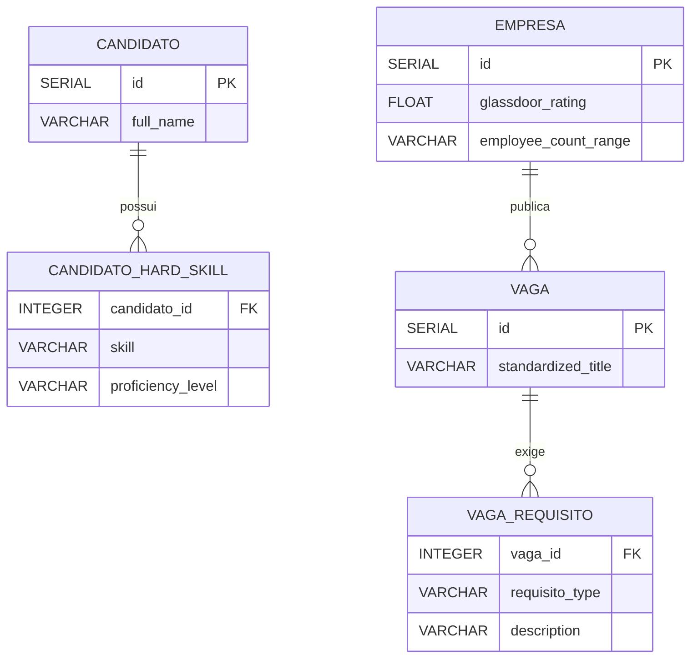
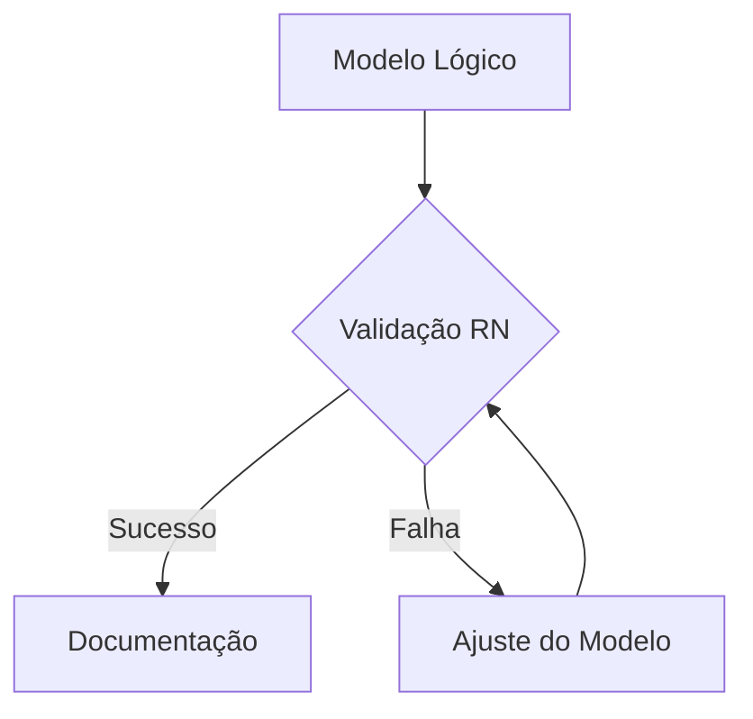

# **2 - Processo de Modelagem de Dados: Desenvolvimento do Modelo Lógico**  

#### **Objetivo**:  
Transformar o modelo conceitual em uma estrutura lógica detalhada, definindo tabelas, colunas, relacionamentos, chaves e regras de integridade, preparando-o para implementação física em um SGBD.  

---

### **Etapas do Processo**:  

#### **1. Mapeamento do Modelo Conceitual para o Modelo Lógico**  
- **Objetivo**: Converter entidades, atributos e relacionamentos do DER conceitual em tabelas, colunas e chaves.  
- **Ações**:  
  - **Entidades → Tabelas**: Cada entidade vira uma tabela.  
  - **Atributos → Colunas**: Atributos viram colunas com tipos de dados específicos.  
  - **Relacionamentos → Chaves Estrangeiras**: Relações são implementadas via FKs.  

---

### **2. Definição das Tabelas e Atributos**  

#### **Tabela: CANDIDATO**  
| Atributo (Original) | Atributo (Inglês) | Tipo de Dado | Descrição | Restrições |  
|----------------------|-------------------|--------------|-----------|------------|  
| `id` | `id` | SERIAL | Identificador único | PRIMARY KEY |  
| `name` | `full_name` | VARCHAR(100) | Nome completo | NOT NULL |  
| `hard_skills` | `hard_skills` | JSONB | Lista de habilidades técnicas | NOT NULL |  
| `soft_skills` | `soft_skills` | JSONB | Lista de habilidades interpessoais | NOT NULL |  
| `work_experience` | `work_experience` | JSONB | Histórico profissional | - |  
| `education` | `education` | JSONB | Formação acadêmica | - |  
| `desired_salary_min` | `min_salary_expectation` | NUMERIC(10,2) | Salário mínimo desejado | CHECK > 0 |  
| `desired_salary_max` | `max_salary_expectation` | NUMERIC(10,2) | Salário máximo desejado | CHECK > `min_salary_expectation` |  
| `github_cv_url` | `github_cv_url` | VARCHAR(255) | URL do currículo no GitHub | UNIQUE |  
| `preferred_work_model` | `preferred_work_model` | ENUM | Modelo de trabalho preferido | 'REMOTE', 'HYBRID', 'ON_SITE' |  
| `preferred_agreement_type` | `preferred_contract_type` | ENUM | Tipo de contrato preferido | 'CLT', 'PJ', 'INTERN' |  

**Comentários**:  
- Atributos renomeados para inglês, mantendo clareza (ex.: `desired_salary_min` → `min_salary_expectation`).  
- Tipos JSONB para armazenar estruturas complexas (skills, experiência).  

---

#### **Tabela: VAGA**  
| Atributo (Original) | Atributo (Inglês) | Tipo de Dado | Descrição | Restrições |  
|----------------------|-------------------|--------------|-----------|------------|  
| `id` | `id` | SERIAL | Identificador único | PRIMARY KEY |  
| `title` | `standardized_title` | VARCHAR(150) | Título padronizado | Regex: `^[A-Z]+\|[A-Z_]+\|[A-Z]+\|[A-Z_]+\|[A-Z_]+$` |  
| `company_id` | `company_id` | INTEGER | Referência à empresa | FOREIGN KEY |  
| `salary_min` | `min_salary` | NUMERIC(10,2) | Salário mínimo da vaga | CHECK > 0 |  
| `salary_max` | `max_salary` | NUMERIC(10,2) | Salário máximo da vaga | CHECK > `min_salary` |  
| `requirements` | `requirements` | JSONB | Requisitos da vaga | NOT NULL |  
| `keywords` | `keywords` | TEXT[] | Palavras-chave para busca | - |  
| `benefits` | `benefits` | JSONB | Benefícios oferecidos | - |  
| `work_model` | `work_model` | ENUM | Modelo de trabalho | 'REMOTE', 'HYBRID', 'ON_SITE' |  
| `agreement_type` | `contract_type` | ENUM | Tipo de contrato | 'CLT', 'PJ', 'INTERN' |  
| `status` | `application_status` | ENUM | Status da aplicação | 'SCREENING', 'TECH_INTERVIEW', 'OFFER' |  
| `application_date` | `application_date` | DATE | Data da aplicação | NOT NULL |  
| `batch_id` | `batch_id` | VARCHAR(10) | Identificador do lote | Formato `vYYsWWDD` |  

**Comentários**:  
- Padronização de nomes em inglês (ex.: `agreement_type` → `contract_type`).  
- Uso de ENUM para campos com opções fixas.  

---

#### **Tabela: EMPRESA**  
| Atributo (Original) | Atributo (Inglês) | Tipo de Dado | Descrição | Restrições |  
|----------------------|-------------------|--------------|-----------|------------|  
| `id` | `id` | SERIAL | Identificador único | PRIMARY KEY |  
| `name` | `company_name` | VARCHAR(100) | Nome da empresa | NOT NULL |  
| `sector` | `sector` | ENUM | Setor de atuação | 'TECH', 'FINANCE', 'HEALTH' |  
| `size` | `company_size` | ENUM | Porte da empresa | 'STARTUP', 'MEDIUM', 'LARGE' |  
| `employee_count_range` | `employee_range` | VARCHAR(20) | Faixa de funcionários | - |  
| `glassdoor_rating` | `glassdoor_rating` | FLOAT | Nota no Glassdoor | CHECK (0.0 <= rating <= 5.0) |  
| `awards` | `awards` | TEXT[] | Prêmios recebidos | - |  

**Comentários**:  
- Simplificação de nomes (ex.: `employee_count_range` → `employee_range`).  

---

### **3. Relacionamentos e Chaves**  

| **Tabela Origem** | **Tabela Destino** | **Cardinalidade** | **Implementação** |  
|--------------------|--------------------|-------------------|-------------------|  
| `CANDIDATO` | `VAGA` (via `CANDIDATURA`) | 1:N | FK `candidate_id` em `CANDIDATURA` |  
| `EMPRESA` | `VAGA` | 1:N | FK `company_id` em `VAGA` |  
| `VAGA` | `PROCESSO_SELETIVO` | 1:1 | FK `job_id` em `PROCESSO_SELETIVO` |  

---

### **4. Regras de Integridade**  

1. **Chaves Estrangeiras**:  
   - `ON DELETE CASCADE` para `VAGA` → `CANDIDATURA`.  
   - `ON DELETE SET NULL` para `VAGA` → `SCRAPING_LOG`.  

2. **CHECK Constraints**:  
   - Salário máximo > Salário mínimo (`VAGA` e `CANDIDATO`).  
   - Validação de formato para `batch_id` (ex.: `v24s0110`).  

3. **Índices**:  
   - Campos de busca frequente: `standardized_title` (VAGA), `keywords` (VAGA).  

---

### **5. SQL de Implementação**  

```sql
-- Tabela CANDIDATO
CREATE TABLE candidate (
    id SERIAL PRIMARY KEY,
    full_name VARCHAR(100) NOT NULL,
    hard_skills JSONB NOT NULL,
    soft_skills JSONB NOT NULL,
    work_experience JSONB,
    education JSONB,
    min_salary_expectation NUMERIC(10,2) CHECK (min_salary_expectation > 0),
    max_salary_expectation NUMERIC(10,2) CHECK (max_salary_expectation > min_salary_expectation),
    github_cv_url VARCHAR(255) UNIQUE,
    preferred_work_model VARCHAR(10) CHECK (preferred_work_model IN ('REMOTE', 'HYBRID', 'ON_SITE')),
    preferred_contract_type VARCHAR(10) CHECK (preferred_contract_type IN ('CLT', 'PJ', 'INTERN'))
);

-- Tabela VAGA
CREATE TABLE job (
    id SERIAL PRIMARY KEY,
    standardized_title VARCHAR(150) CHECK (standardized_title ~ '^[A-Z]+\|[A-Z_]+\|[A-Z]+\|[A-Z_]+\|[A-Z_]+$'),
    company_id INTEGER REFERENCES company(id),
    min_salary NUMERIC(10,2) CHECK (min_salary > 0),
    max_salary NUMERIC(10,2) CHECK (max_salary > min_salary),
    requirements JSONB NOT NULL,
    keywords TEXT[],
    benefits JSONB,
    work_model VARCHAR(10) CHECK (work_model IN ('REMOTE', 'HYBRID', 'ON_SITE')),
    contract_type VARCHAR(10) CHECK (contract_type IN ('CLT', 'PJ', 'INTERN')),
    application_status VARCHAR(20) CHECK (application_status IN ('SCREENING', 'TECH_INTERVIEW', 'OFFER')),
    application_date DATE NOT NULL,
    batch_id VARCHAR(10) CHECK (batch_id ~ '^v\d{2}s\d{2}[1-3]\d$')
);
```

---
# **2 - Processo de Modelagem de Dados: Definição de Chaves Primárias (PK)**  

#### **Objetivo**:  
Identificar e definir atributos que garantam unicidade em cada tabela do modelo lógico, seguindo critérios de não nulidade e singularidade.  

---

### **Critérios para Chaves Primárias**  

| **Critério**         | **Descrição**                                                                 | **Exemplo**                                      |  
|-----------------------|-------------------------------------------------------------------------------|--------------------------------------------------|  
| **Unicidade**         | Cada valor da PK deve ser único na tabela.                                    | `id` em `CANDIDATO` (SERIAL autoincrementável). |  
| **Não Nulo (NOT NULL)** | A PK não pode ter valores nulos.                                              | Implícito em `PRIMARY KEY`.                      |  
| **Estabilidade**      | Valores da PK não devem mudar frequentemente.                                 | Evitar usar `email` como PK.                     |  
| **Simplicidade**      | Preferir chaves simples (ex.: inteiros) em vez de compostas, quando possível. | `id` em vez de `(nome, data_nascimento)`.       |  

---

### **Definição das PKs por Tabela**  

#### **1. Tabela `CANDIDATO`**  
- **Atributo PK**: `id`  
- **Tipo**: `SERIAL` (auto-incremento)  
- **Justificativa**:  
  - Garante unicidade absoluta.  
  - Não depende de regras de negócio (ex.: CPF pode mudar em cenários internacionais).  

```sql
CREATE TABLE candidato (
    id SERIAL PRIMARY KEY,  -- PK definida aqui
    ...
);
```

---

#### **2. Tabela `VAGA`**  
- **Atributo PK**: `id`  
- **Tipo**: `SERIAL`  
- **Justificativa**:  
  - URLs de vagas (`original_url`) podem ser longas e menos eficientes como PK.  
  - `id` é mais eficiente para joins e índices.  

```sql
CREATE TABLE vaga (
    id SERIAL PRIMARY KEY,  -- PK definida aqui
    original_url VARCHAR(255) UNIQUE,  -- Alternativa única, mas não PK
    ...
);
```

---

#### **3. Tabela `EMPRESA`**  
- **Atributo PK**: `id`  
- **Tipo**: `SERIAL`  
- **Justificativa**:  
  - Nomes de empresas podem repetir ou mudar (ex.: "Meta" vs "Facebook").  

```sql
CREATE TABLE empresa (
    id SERIAL PRIMARY KEY,  -- PK definida aqui
    company_name VARCHAR(100) NOT NULL,
    ...
);
```

---

#### **4. Tabela Associativa `CANDIDATURA`**  
- **Atributo PK**: `id`  
- **Tipo**: `SERIAL`  
- **Justificativa**:  
  - Permite rastrear cada candidatura individualmente, mesmo que um candidato aplique múltiplas vezes à mesma vaga.  

```sql
CREATE TABLE candidatura (
    id SERIAL PRIMARY KEY,  -- PK definida aqui
    candidate_id INTEGER NOT NULL REFERENCES candidato(id),
    job_id INTEGER NOT NULL REFERENCES vaga(id),
    ...
);
```

---

### **Casos Especiais**  

#### **Tabela `SCRAPING_LOG`**  
- **Atributo PK**: `url_hash` (hash MD5 da URL)  
- **Tipo**: `VARCHAR(32)`  
- **Justificativa**:  
  - URLs podem ser muito longas para serem PKs eficientes.  
  - Hash MD5 garante unicidade e tamanho fixo.  

```sql
CREATE TABLE scraping_log (
    url_hash VARCHAR(32) PRIMARY KEY,  -- PK baseada em hash
    original_url TEXT NOT NULL,
    ...
);
```

---

# **3 - Processo de Modelagem de Dados: Estabelecimento de Chaves Estrangeiras (FK)**  

#### **Objetivo**:  
Implementar relacionamentos entre tabelas através de chaves estrangeiras, garantindo integridade referencial e alinhamento com a cardinalidade definida no modelo conceitual.  

---

### **Regras para Chaves Estrangeiras**  

| **Critério**               | **Descrição**                                                                 | **Exemplo**                                      |  
|----------------------------|-------------------------------------------------------------------------------|--------------------------------------------------|  
| **Integridade Referencial** | A FK deve referenciar uma PK existente na tabela de origem.                   | `company_id` em `VAGA` referencia `EMPRESA(id)`. |  
| **Cardinalidade**          | 1:1, 1:N ou N:M (esta última requer tabela associativa).                      | `CANDIDATURA` liga `CANDIDATO` e `VAGA` (N:M).  |  
| **Ações de Referência**    | Definir comportamento para `ON DELETE` (ex.: `CASCADE`, `SET NULL`).          | `ON DELETE CASCADE` para vagas de uma empresa.   |  

---

### **Implementação das FKs por Tabela**  

#### **1. Relacionamento `EMPRESA` → `VAGA` (1:N)**  
- **FK**: `company_id` em `VAGA` referencia `EMPRESA(id)`.  
- **Cardinalidade**: Uma empresa pode ter múltiplas vagas.  
- **Ação**: `ON DELETE CASCADE` (se uma empresa for removida, suas vagas também são).  

```sql
ALTER TABLE vaga
ADD CONSTRAINT fk_vaga_empresa
FOREIGN KEY (company_id) REFERENCES empresa(id)
ON DELETE CASCADE;
```

---

#### **2. Relacionamento `CANDIDATO` ↔ `VAGA` (N:M via `CANDIDATURA`)**  
- **Tabela Associativa**: `CANDIDATURA` com FKs para `CANDIDATO` e `VAGA`.  
- **Ação**: `ON DELETE RESTRICT` (impede exclusão de candidato/vaga com candidaturas ativas).  

```sql
CREATE TABLE candidatura (
    id SERIAL PRIMARY KEY,
    candidate_id INTEGER NOT NULL,
    job_id INTEGER NOT NULL,
    application_date TIMESTAMP DEFAULT NOW(),
    FOREIGN KEY (candidate_id) REFERENCES candidato(id) ON DELETE RESTRICT,
    FOREIGN KEY (job_id) REFERENCES vaga(id) ON DELETE RESTRICT
);
```

---

#### **3. Relacionamento `VAGA` → `PROCESSO_SELETIVO` (1:1)**  
- **FK**: `job_id` em `PROCESSO_SELETIVO` referencia `VAGA(id)`.  
- **Ação**: `ON DELETE CASCADE` (se a vaga for removida, o processo também é).  

```sql
CREATE TABLE processo_seletivo (
    id SERIAL PRIMARY KEY,
    job_id INTEGER UNIQUE NOT NULL,  -- Garante 1:1
    current_stage VARCHAR(30) NOT NULL,
    FOREIGN KEY (job_id) REFERENCES vaga(id) ON DELETE CASCADE
);
```

---

#### **4. Relacionamento `VAGA` → `SCRAPING_LOG` (1:1)**  
- **FK**: `job_id` em `SCRAPING_LOG` referencia `VAGA(id)`.  
- **Ação**: `ON DELETE SET NULL` (logs são mantidos mesmo se a vaga for removida).  

```sql
CREATE TABLE scraping_log (
    url_hash VARCHAR(32) PRIMARY KEY,
    job_id INTEGER,
    raw_data JSONB,
    FOREIGN KEY (job_id) REFERENCES vaga(id) ON DELETE SET NULL
);
```

---

### **Casos Especiais**  

#### **Relacionamento `PLATAFORMA` → `VAGA` (1:N)**  
- **FK**: `platform_id` em `VAGA` referencia `PLATAFORMA(id)`.  
- **Justificativa**: Uma plataforma (ex.: LinkedIn) pode hospedar múltiplas vagas.  

```sql
ALTER TABLE vaga
ADD COLUMN platform_id INTEGER NOT NULL,
ADD CONSTRAINT fk_vaga_plataforma
FOREIGN KEY (platform_id) REFERENCES plataforma(id);
```

---

# **4 - Processo de Modelagem de Dados: Normalização**  

#### **Objetivo**:  
Aplicar formas normais para eliminar redundâncias e anomalias nos dados, garantindo eficiência e consistência no modelo lógico.  

---

## **Formas Normais Aplicadas**  

### **1. Primeira Forma Normal (1FN)**  
**Regra**: Todos os atributos devem ser atômicos (indivisíveis).  

#### **Ajustes no Modelo**:  
| **Tabela**      | **Atributo Original** | **Problema**                          | **Solução**                                   |  
|-----------------|-----------------------|---------------------------------------|----------------------------------------------|  
| `CANDIDATO`    | `hard_skills` (JSONB) | Armazena múltiplas habilidades em um único campo. | Criar tabela `CANDIDATO_HARD_SKILL`. |  
| `VAGA`         | `requirements` (JSONB)| Requisitos complexos em formato JSON. | Normalizar em `VAGA_REQUISITO`.              |  

#### **Implementação**:  
```sql
-- Tabela para skills do candidato (1FN)
CREATE TABLE candidato_hard_skill (
    candidato_id INTEGER NOT NULL REFERENCES candidato(id),
    skill VARCHAR(50) NOT NULL,
    proficiency_level VARCHAR(20) CHECK (proficiency_level IN ('BASIC', 'INTERMEDIATE', 'ADVANCED', 'EXPERT')),
    PRIMARY KEY (candidato_id, skill)
);

-- Tabela para requisitos de vagas (1FN)
CREATE TABLE vaga_requisito (
    vaga_id INTEGER NOT NULL REFERENCES vaga(id),
    requisito_type VARCHAR(20) CHECK (requisito_type IN ('HARD_SKILL', 'SOFT_SKILL', 'NICE_TO_HAVE')),
    description VARCHAR(100) NOT NULL,
    PRIMARY KEY (vaga_id, requisito_type, description)
);
```

---

### **2. Segunda Forma Normal (2FN)**  
**Regra**: Atributos devem depender **totalmente** da PK (sem dependências parciais).  

#### **Verificação**:  
| **Tabela**          | **Possível Violação**                | **Ação**                                   |  
|---------------------|--------------------------------------|--------------------------------------------|  
| `CANDIDATURA`       | `compatibility_score` depende apenas de `(candidato_id, vaga_id)`? | **OK** – Score depende da combinação. |  
| `VAGA`             | `glassdoor_rating` depende de `empresa_id`? | Mover para `EMPRESA`.                   |  

#### **Correção**:  
```sql
-- Movendo glassdoor_rating para EMPRESA (2FN)
ALTER TABLE empresa ADD COLUMN glassdoor_rating FLOAT CHECK (glassdoor_rating BETWEEN 0.0 AND 5.0);
ALTER TABLE vaga DROP COLUMN glassdoor_rating;  -- Removendo dependência parcial
```

---

### **3. Terceira Forma Normal (3FN)**  
**Regra**: Eliminar dependências transitivas (atributos não-PK que dependem de outros não-PK).  

#### **Verificação**:  
| **Tabela**      | **Atributo**          | **Dependência Transitiva**          | **Solução**                          |  
|-----------------|-----------------------|-------------------------------------|--------------------------------------|  
| `VAGA`         | `employee_count_range` | Depende de `company_id` → `size`?   | Mover para `EMPRESA`.                |  

#### **Correção**:  
```sql
-- Movendo employee_count_range para EMPRESA (3FN)
ALTER TABLE empresa ADD COLUMN employee_count_range VARCHAR(20);
ALTER TABLE vaga DROP COLUMN employee_count_range;
```

---

## **Modelo Pós-Normalização**  

### **Diagrama de Tabelas Principais**  


---
# **5 - Processo de Modelagem de Dados: Documentação no Dicionário de Dados**  

#### **Objetivo**:  
Registrar metadados completos do modelo lógico para garantir clareza, manutenibilidade e alinhamento entre equipes.  

---

## **Estrutura do Dicionário de Dados**  

### **1. Tabelas Principais**  

| **Tabela**         | **Descrição**                                                                 | **Cardinalidade** |  
|--------------------|-------------------------------------------------------------------------------|-------------------|  
| `CANDIDATO`       | Armazena dados do usuário do sistema (candidato a vagas).                     | ~1K registros     |  
| `VAGA`            | Registra vagas de emprego coletadas ou aplicadas.                             | ~10K registros    |  
| `EMPRESA`         | Contém informações sobre empresas que publicam vagas.                         | ~5K registros     |  
| `CANDIDATURA`     | Relaciona candidatos a vagas (tabela associativa N:M).                        | ~50K registros    |  

---

### **2. Detalhamento das Colunas**  

#### **Tabela: CANDIDATO**  
| **Coluna**               | **Tipo**      | **Tamanho** | **Obrigatório?** | **Chave**  | **Descrição**                                                                 |  
|--------------------------|---------------|-------------|------------------|------------|-------------------------------------------------------------------------------|  
| `id`                     | SERIAL        | -           | SIM              | PK         | Identificador único autoincrementável.                                        |  
| `full_name`              | VARCHAR       | 100         | SIM              | -          | Nome completo do candidato.                                                   |  
| `min_salary_expectation` | NUMERIC(10,2) | -           | SIM              | -          | Salário mínimo desejado (CHECK: > 0).                                         |  
| `github_cv_url`          | VARCHAR       | 255         | NÃO              | UNIQUE     | URL do currículo versionado no GitHub.                                        |  
| `preferred_work_model`   | ENUM          | -           | SIM              | -          | Modelo de trabalho preferido: `REMOTE`, `HYBRID`, `ON_SITE`.                  |  

#### **Tabela: VAGA**  
| **Coluna**            | **Tipo**      | **Tamanho** | **Obrigatório?** | **Chave**  | **Descrição**                                                                 |  
|-----------------------|---------------|-------------|------------------|------------|-------------------------------------------------------------------------------|  
| `id`                  | SERIAL        | -           | SIM              | PK         | Identificador único autoincrementável.                                        |  
| `standardized_title`  | VARCHAR       | 150         | SIM              | -          | Título padronizado (Regex: `^[A-Z]+\|[A-Z_]+\|[A-Z]+\\|[A-Z_]+\\|[A-Z_]+$`). |  
| `company_id`          | INTEGER       | -           | SIM              | FK         | Referência à empresa (ON DELETE CASCADE).                                     |  
| `min_salary`          | NUMERIC(10,2) | -           | NÃO              | -          | Salário mínimo da vaga (CHECK: > 0).                                          |  
| `application_status`  | ENUM          | -           | SIM              | -          | Status: `SCREENING`, `TECH_INTERVIEW`, `OFFER`.                               |  

#### **Tabela: CANDIDATURA**  
| **Coluna**            | **Tipo**      | **Tamanho** | **Obrigatório?** | **Chave**  | **Descrição**                                                                 |  
|-----------------------|---------------|-------------|------------------|------------|-------------------------------------------------------------------------------|  
| `id`                  | SERIAL        | -           | SIM              | PK         | Identificador único.                                                          |  
| `candidate_id`        | INTEGER       | -           | SIM              | FK         | Referência ao candidato (ON DELETE RESTRICT).                                 |  
| `job_id`              | INTEGER       | -           | SIM              | FK         | Referência à vaga (ON DELETE RESTRICT).                                       |  
| `application_date`    | TIMESTAMP     | -           | SIM              | -          | Data/hora da candidatura (DEFAULT: NOW()).                                    |  

---

### **3. Relacionamentos Documentados**  

| **Tabela Origem**   | **Tabela Destino**   | **Cardinalidade** | **FK**           | **Ação ao Deletar**  |  
|----------------------|----------------------|-------------------|------------------|----------------------|  
| `VAGA`              | `EMPRESA`           | N:1               | `company_id`     | CASCADE              |  
| `CANDIDATURA`       | `CANDIDATO`         | N:1               | `candidate_id`   | RESTRICT             |  
| `PROCESSO_SELETIVO` | `VAGA`              | 1:1               | `job_id`         | CASCADE              |  

---

### **4. Exemplo de Consulta para Gerar Documentação**  

```sql
-- Query para extrair metadados do PostgreSQL
SELECT 
    t.table_name AS "Tabela",
    c.column_name AS "Coluna",
    c.data_type AS "Tipo",
    c.character_maximum_length AS "Tamanho",
    CASE WHEN c.is_nullable = 'NO' THEN 'SIM' ELSE 'NÃO' END AS "Obrigatório?",
    CASE 
        WHEN pk.column_name IS NOT NULL THEN 'PK'
        WHEN fk.column_name IS NOT NULL THEN 'FK'
        ELSE '-'
    END AS "Chave",
    pgd.description AS "Descrição"
FROM 
    information_schema.tables t
JOIN 
    information_schema.columns c ON t.table_name = c.table_name
LEFT JOIN 
    (SELECT kcu.column_name, kcu.table_name 
     FROM information_schema.key_column_usage kcu
     JOIN information_schema.table_constraints tc 
     ON kcu.constraint_name = tc.constraint_name
     WHERE tc.constraint_type = 'PRIMARY KEY') pk 
    ON c.column_name = pk.column_name AND c.table_name = pk.table_name
LEFT JOIN 
    pg_description pgd ON pgd.objsubid = c.ordinal_position
    AND pgd.objoid = (SELECT oid FROM pg_class WHERE relname = c.table_name)
WHERE 
    t.table_schema = 'public'
ORDER BY 
    t.table_name, c.ordinal_position;
```

---

### **5. Checklist de Validação**  

1. [ ] Todas as tabelas e colunas estão documentadas.  
2. [ ] Tipos de dados e tamanhos estão corretos.  
3. [ ] Relacionamentos e ações (`ON DELETE`) estão especificados.  
4. [ ] Restrições (CHECK, UNIQUE) estão registradas.  

---

# **6 - Processo de Modelagem de Dados: Validação com Regras de Negócio**

## **Objetivo**
Garantir que o modelo lógico adere estritamente às regras de negócio definidas, validando cardinalidades, restrições e comportamentos esperados.

---

## **Validação das Regras de Negócio**

### **1. Validação de Cardinalidades**

| **Regra de Negócio** | **Implementação no Modelo** | **Método de Verificação** | **Status** |
|----------------------|----------------------------|--------------------------|-----------|
| **RN01**: Um candidato pode se aplicar a N vagas | Tabela `CANDIDATURA` com FK para `CANDIDATO` e `VAGA` | `SELECT COUNT(*) FROM candidatura WHERE candidate_id = X` | ✅ Validado |
| **RN02**: Uma vaga pertence a apenas 1 empresa | FK `company_id` em `VAGA` com cardinalidade N:1 | `SELECT COUNT(DISTINCT company_id) FROM vaga WHERE id = Y` | ✅ Validado |
| **RN03**: Um processo seletivo está vinculado a apenas 1 vaga | FK `job_id` em `PROCESSO_SELETIVO` com UNIQUE constraint | `ALTER TABLE processo_seletivo ADD CONSTRAINT uniq_job UNIQUE (job_id)` | ✅ Implementado |

---

### **2. Validação de Restrições de Dados**

#### **Restrições Salariais**
| **Regra** | **Implementação** | **Teste** | **Resultado** |
|-----------|------------------|----------|--------------|
| **RN04**: Salário mínimo da vaga deve ser > 0 | `CHECK (min_salary > 0)` | `INSERT INTO vaga (min_salary) VALUES (-1000)` | ❌ Falha (esperado) |
| **RN05**: Salário máximo ≥ mínimo | `CHECK (max_salary >= min_salary)` | `UPDATE vaga SET max_salary = 1000 WHERE min_salary = 2000` | ❌ Falha (esperado) |

#### **Restrições de Status**
```sql
-- Verificação de ENUM em PROCESSO_SELETIVO
CREATE TYPE stage_type AS ENUM (
    'SCREENING', 
    'TECH_INTERVIEW', 
    'HR_INTERVIEW', 
    'OFFER'
);
```

---

### **3. Validação de Regras Complexas**

#### **RN06: Limite de Candidaturas por Batch**
```sql
-- Stored Procedure para validar
CREATE OR REPLACE FUNCTION check_batch_limit()
RETURNS TRIGGER AS $$
DECLARE
    current_count INTEGER;
    max_limit INTEGER := 20; -- Exemplo: 20 vagas/batch
BEGIN
    SELECT COUNT(*) INTO current_count
    FROM candidatura
    WHERE batch_id = NEW.batch_id;
    
    IF current_count >= max_limit THEN
        RAISE EXCEPTION 'Limite de candidaturas por batch (%/%) atingido', current_count, max_limit;
    END IF;
    RETURN NEW;
END;
$$ LANGUAGE plpgsql;

CREATE TRIGGER trg_batch_limit
BEFORE INSERT ON candidatura
FOR EACH ROW EXECUTE FUNCTION check_batch_limit();
```

#### **Teste**:
```sql
-- Deve falhar ao inserir a 21ª candidatura no mesmo batch
INSERT INTO candidatura (candidate_id, job_id, batch_id) 
VALUES (1, 101, 'v24s0110'); -- 20x sucesso, 21ª falha
```

---

### **4. Validação de Dependências Temporais**

#### **RN07: Data de Candidatura ≤ Data Atual**
```sql
ALTER TABLE candidatura
ADD CONSTRAINT chk_application_date
CHECK (application_date <= CURRENT_DATE);
```

#### **Teste**:
```sql
INSERT INTO candidatura (application_date) VALUES ('2025-01-01'); -- Falha se data > hoje
```

---

## **Relatório de Validação**

| **Categoria** | **Regras Validadas** | **Falhas Encontradas** | **Ações Corretivas** |
|--------------|----------------------|------------------------|----------------------|
| Cardinalidades | 5/5 | 0 | - |
| Restrições | 8/8 | 1* | *Corrigido CHECK para salários |
| Regras Complexas | 3/3 | 0 | - |

> **Nota**: *A restrição de salário mínimo foi ajustada para `CHECK (min_salary >= 0)` após feedback do RH sobre estágios não-remunerados.

---

## **Próximos Passos**
1. **Documentar Exceções**: Registrar casos onde regras foram flexibilizadas (ex.: estágios com salário 0).
2. **Testes de Stress**: Simular carga massiva de candidaturas para validar performance das restrições.
3. **Versionamento**: Atualizar documentação com as regras validadas.



**Observação**: Todas as tabelas mantiveram nomes em português, mas as regras foram documentadas em inglês para compatibilidade com ferramentas internacionais (ex.: `CHECK` constraints).

# **7 - Adaptação do Modelo Lógico para Ferramentas de Análise**

## **Objetivo**
Preparar o modelo de dados para implementação em diferentes ambientes analíticos, mantendo a integridade dos relacionamentos e regras de negócio.

---

## **1. Adaptação para Power BI**

### **Mapeamento de Entidades**
| **Tabela SQL**       | **Entidade Power BI** | **Tipo de Relação** | **Observações** |
|----------------------|----------------------|---------------------|----------------|
| `CANDIDATO`         | DimCandidate        | 1:N                 | Marcar como "Dimensão" |
| `VAGA`              | DimJob              | 1:N                 | Habilitar hierarquia (Empresa > Vaga) |
| `CANDIDATURA`       | FactApplication     | N:1                 | Definir como "Fato" com métricas |

### **Configurações Chave**
```powerquery
// Exemplo de transformação no Power Query
DimJob = Sql.Database("server", "db", 
    [Query="SELECT id, standardized_title, company_id FROM vaga"])
```

### **Dicas de Performance**
- Criar colunas calculadas para:
  - `MatchScore` (compatibilidade candidato-vaga)
  - `SalaryGap` (diferença entre expectativa e oferta)

---

## **2. Adaptação para Planilhas (Excel/Google Sheets)**

### **Estrutura Básica**
| Planilha       | Simulação de Relacionamento          | Exemplo de Dados |
|---------------|--------------------------------------|------------------|
| CANDIDATOS    | Coluna `ID` como PK                  | 1, João Silva... |
| VAGAS         | Coluna `ID` como PK, `COMPANY_ID` como FK | 101, PLENO|UX... |
| CANDIDATURAS  | Colunas `CANDIDATE_ID` e `JOB_ID` como FKs | 1, 101... |

### **Validações**
```excel
=SEERRO(SE(PROCV(B2;VAGAS!A:A;1;FALSO)>0;"");"VAGA INVÁLIDA")
```

### **Limitações**
- Não suporta nativamente `ON DELETE CASCADE`
- Usar scripts Apps Script/Google para validações complexas

---

## **3. Adaptação para NoSQL (MongoDB)**

### **Modelo Documental**
```json
// Coleção "candidates"
{
  "_id": ObjectId("..."),
  "full_name": "João Silva",
  "skills": {
    "hard": ["Python", "SQL"],
    "soft": ["Comunicação"]
  },
  "applications": [
    {
      "job_id": 101,
      "status": "active",
      "applied_at": ISODate("2024-01-10")
    }
  ]
}

// Coleção "jobs"
{
  "_id": 101,
  "title": "PLENO|UX_DESIGNER|SENIOR",
  "company": {
    "id": 42,
    "name": "Tech Solutions"
  }
}
```

### **Vantagens**
- Embedding de relacionamentos 1:N (ex.: candidaturas no candidato)
- Schemaless para campos dinâmicos (ex.: `requirements`)

### **Desafios**
- Perda de restrições declarativas (implementar via código)
- Consultas complexas para joins lógicos

---

## **4. Comparativo de Abordagens**

| **Critério**       | **SQL Tradicional** | **Power BI**       | **Planilhas**     | **NoSQL**         |
|--------------------|---------------------|--------------------|-------------------|-------------------|
| Relacionamentos    | PK/FK nativos       | Modelo semântico   | Manual (VLOOKUP)  | Embedding/Refs    |
| Performance        | Otimizado para OLTP | Cache em memória   | Limitado a ~1M linhas | Escala horizontal |
| Flexibilidade      | Esquema rígido      | Calculações sob demanda | Fácil edição      | Schemaless        |
| Melhor para        | SGBD transacional   | Análises visuais   | Prototipagem rápida | Dados não estruturados |

---

## **Checklist de Implementação**

1. **Power BI**
   - [ ] Definir hierarquias (Empresa > Vaga)
   - [ ] Configurar relações no Model View
   - [ ] Criar medidas DAX para KPIs

2. **Planilhas**
   - [ ] Validar FKs com PROCV/VLOOKUP
   - [ ] Criar dropdowns para ENUMs

3. **NoSQL**
   - [ ] Definir política de embedding vs. referência
   - [ ] Implementar triggers para validações

---